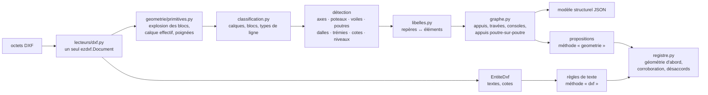
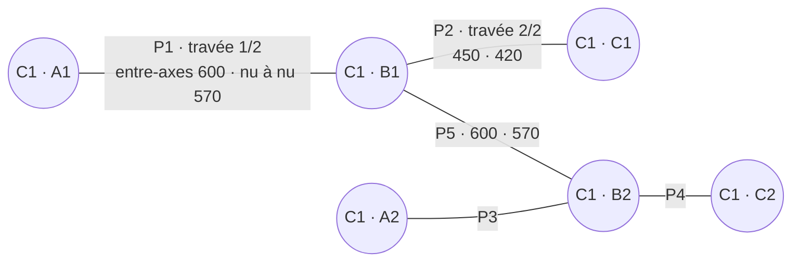

# Lecture géométrique des DXF — du dessin au modèle structurel

> Conception écrite **avant** le code. Elle prolonge
> [`LECTURE_DES_PLANS.md`](LECTURE_DES_PLANS.md) : même circuit (proposition →
> décision nommée → report → contrôle au calcul), une nouvelle **source** de
> propositions — la géométrie du dessin.

## 0. Point de départ mesuré

Le lot précédent lit un DXF comme un texte : les `TEXT`, `MTEXT`, `ATTRIB`
passent par les règles d'écriture, chaque `DIMENSION` devient une « cote », un
texte court sur un calque d'axes devient une « file ». Les traits ne sont pas
lus.

Mesuré sur un plan de coffrage fictif (`S-101` : trois files A–C, deux files
1–2, six poteaux, cinq poutres, deux dalles, une coupe au 1/20, unité du dessin
cm), le dépôt du DXF rend **43 propositions** et :

| ce que le dessin contient | ce qui est proposé aujourd'hui |
|---|---|
| poutres P1 (A→B) et P2 (B→C), entre-axes 600 et 450 cm, dessinées en rectangles | **aucune portée** : aucun texte ne l'écrit |
| six poteaux 30×30 dessinés pleins aux nœuds | une seule largeur/profondeur, tirée du texte « C1 30x30 » |
| cotes A–B 600, B–C 450, A–C 1050 sur le calque `COTES` | trois « cotes » non classées : le calque n'est pas un calque d'axes |
| cotes de la coupe au 1/20 (`DIMLFAC = 0,4`), affichées 30 et 60 | **75 et 150 cm** — le facteur d'échelle des cotes est ignoré (défaut corrigé dans ce lot) |
| la poutre P5 appuyée sur deux poteaux | rien ne relie une poutre à ses appuis |

Ce lot fait du dessin la source principale d'un DXF : les éléments sont
**reconnus dans les traits**, reliés en **graphe**, et les portées sont
**mesurées entre appuis** — sans qu'aucun texte ne les écrive.

## 1. Architecture



**Un module séparé, sans dépendance nouvelle.** `eurostruct_extraction/geometrie/`
ne connaît ni la base, ni le réseau, ni le moteur de calcul. Il n'utilise
qu'`ezdxf` (déjà présent, MIT) et la géométrie plane écrite ici — pas de
`shapely`, pas de bibliothèque native de plus dans l'image.

| fichier | rôle |
|---|---|
| `primitives.py` | parcours de l'espace objet, explosion récursive des `INSERT` (transformation, `MINSERT`), calque et type de ligne **effectifs**, poignées d'origine |
| `noyau.py` | vecteurs, segments, polygones, projections, découpe par une bande, tolérances, quantification |
| `classification.py` | rôle d'un calque, d'un bloc, d'un type de ligne — table multilingue FR/NL/EN/DE, normes AIA (`S-COLS`…) |
| `axes.py` | files, bulles, familles parallèles, entraxes, nœuds de grille |
| `poteaux.py`, `voiles.py` | contours fermés, cercles, hachures, solides, rectangles reconstitués |
| `poutres.py` | bandes (paires de traits parallèles, rectangles allongés), fusion à travers les appuis, poutres filaires |
| `dalles.py` | panneaux entre porteurs, marqueurs en croix, contours sur calque de dalle, trémies |
| `cotes.py` | mesure, texte affiché, `DIMLFAC`, cote forcée, chaînes, rattachement aux éléments |
| `libelles.py` | boîtes orientées des textes, analyse des repères, affectation par coût |
| `graphe.py` | appuis le long de chaque poutre, travées, consoles, poutre sur poutre, nœuds et arêtes |
| `modele.py` | dataclasses gelées du modèle, export JSON (`eurostruct.structure/1`) |
| `propositions.py` | modèle → `Candidat` (méthode `geometrie`), regroupements, confiance |
| `extracteur.py` | `ExtracteurGeometrieDxf` : l'entrée dans la chaîne d'extraction |

**Une seule lecture du fichier.** `lire_dxf` ouvre le document une fois et rend
à la fois les entités de texte (inchangées) et les primitives géométriques.
`DocumentAnalyse` porte les primitives hors représentation (`repr=False`),
comme les octets.

## 2. Lecture des entités

**Espace objet seulement.** Les présentations (cartouche, fenêtres) ne sont
pas un plan.

| entité | ce qui en est tiré |
|---|---|
| `LINE` | un segment |
| `LWPOLYLINE`, `POLYLINE` 2D | des segments ; si fermée, un **contour** ; un arrondi (bulge) devient un arc, jamais une corde |
| `CIRCLE`, `ARC` | cercle (poteau rond, bulle d'axe), arc (non porteur) |
| `SOLID`, `TRACE` | contour rempli (poteau dessiné plein) |
| `HATCH` | contours des chemins polylignes ; un chemin d'arêtes est rendu en segments |
| `TEXT`, `MTEXT`, `ATTRIB` | texte, point d'ancrage, rotation, hauteur, **boîte réelle** (`ezdxf.bbox`, métrique des polices) |
| `DIMENSION` | points de définition, direction, mesure, `DIMLFAC`, texte affiché, texte forcé |
| `INSERT` | nom du bloc, transformation, attributs ; son contenu est **explosé** dans le repère du dessin |

**Les règles du DAO, appliquées.**

* un élément de bloc sur le calque `0` prend le calque de l'`INSERT` ; un type
  de ligne `BYBLOCK` prend celui de l'`INSERT`, `BYLAYER` celui du calque ;
* un calque **éteint ou gelé** n'est pas lu — le plan imprimé ne le montre pas ;
  le compte rendu nomme les calques écartés ;
* la poignée tracée est celle de l'entité **source** dans le bloc
  (`source_of_copy`) **et** celle de l'`INSERT` qui l'a placée : un poteau
  inséré cinquante fois se retrouve cinquante fois ;
* profondeur d'imbrication bornée (8), nombre de primitives borné (200 000) ;
  au-delà, la lecture s'arrête et le statut est `partiel`.

**Refus explicites** (interdiction 6) : une référence externe (`XREF`) n'est
pas dans le fichier — elle est nommée, pas devinée ; les solides 3D, régions
ACIS et entités proxy sont comptés et ignorés ; une grille polaire ou une
poutre courbe est signalée « non prise en charge » au lieu d'être approchée.

## 3. Unités et tolérances

**L'unité de la géométrie est celle du dessin**, `$INSUNITS` (mm, cm, m, in,
ft), citée comme déclaration — exactement la règle déjà suivie pour les cotes.
Le texte « P1 30x60 » n'en hérite toujours pas : `$INSUNITS` dit en quoi les
traits sont tracés, pas en quoi les annotations sont écrites.

**Dessin sans unité (`$INSUNITS = 0`).** L'unité n'est attachée que si deux
sources concordent : une déclaration écrite (« Cotes en cm ») **et** au moins
deux cotes rattachées dont la valeur affichée est la mesure géométrique
(rapport 1, aucune contradiction). La proposition cite les deux. Sinon, les
longueurs sont proposées **sans unité** et ne se reportent qu'après correction.

**Tolérances** (en unités du dessin) : 1 mm réel si l'unité est connue
(0,1 cm ; 0,001 m), sinon 10⁻⁵ de la diagonale de l'emprise. Angles : 0,2°
pour le parallélisme, 1° pour l'équerrage.

**Quantification, pas arrondi** (interdiction 9). Une distance calculée en
flottants (`600.0000000001`) est ramenée au micromètre réel (10⁻⁴ cm) ; la
valeur brute est conservée dans le fondement. Aucune valeur n'est arrondie à
la cote « attendue ».

## 4. Classification : calques, blocs, types de ligne

Chaque primitive reçoit un **rôle** : `axe`, `poteau`, `poutre`, `voile`,
`dalle`, `tremie`, `cote`, `texte`, `armature`, `cadre`, `hachure`, `inconnu`.

| rôle | calques (extraits, insensibles à la casse et aux accents) |
|---|---|
| axe | `axe(s)`, `grid`, `grille`, `trame`, `stramien`, `raster`, `achse(n)`, `S-GRID` |
| poteau | `poteau(x)`, `colonne`, `column`, `col(s)`, `kolom(men)`, `stütze(n)`, `S-COLS` |
| poutre | `poutre(s)`, `retombée`, `linteau`, `beam(s)`, `balk(en)`, `unterzug`, `S-BEAM` |
| voile | `voile(s)`, `mur(s)`, `refend`, `wall(s)`, `wand(en)`, `S-WALL` |
| dalle | `dalle(s)`, `plancher`, `hourdis`, `prédalle`, `slab`, `vloer`, `plaat`, `decke`, `S-SLAB` |
| trémie | `trémie`, `réservation`, `ouverture`, `opening`, `sparing`, `aussparung` |
| cote, texte | `cote(s)`, `cotation`, `dim`, `maatvoering`, `bemassung` ; `texte`, `anno`, `repère`, `légende` |
| armature, cadre | `ferraillage`, `armature`, `wapening`, `bewehrung` ; `cartouche`, `cadre`, `title`, `kader` |

* **Le plus spécifique l'emporte** : un calque `S-BEAM-TEXT` est un calque de
  texte, pas de poutre.
* **Un bloc parle aussi** : `POT30x30`, `COL-400x400`, `AXE`, `BUBBLE`, `NIV` ;
  le rôle d'un bloc prime sur celui de son calque d'insertion.
* **Le type de ligne aussi** : `CENTER`, `DASHDOT`, `ACAD_ISO04W100`… signale un
  axe ; `HIDDEN`, `DASHED` une retombée de poutre vue par-dessous.
* **Un calque générique** (`COFFRAGE`, `STRUCTURE`, `0`) ne classe rien : les
  éléments y sont reconnus par leur **forme et leur position** (§5), avec une
  confiance plus basse, et le fondement le dit.

## 5. Détection des éléments

Chaque élément détecté porte : identifiant stable, géométrie, poignées et
calques sources, **règle de classement** (`calque`, `bloc`, `forme`) et
confiance. Les ordres de parcours sont triés par coordonnées puis poignée : le
résultat ne dépend d'aucun hasard.

### 5.1 Axes (files)

1. **Candidats** : segments de rôle `axe`, ou de type de ligne d'axe sur un
   calque non classé, d'une longueur ≥ 30 % de l'emprise dans leur direction.
   Les segments colinéaires qui se recouvrent sont fusionnés.
2. **Étiquette** : à chaque extrémité, un cercle (bulle) centré sur le
   prolongement de l'axe et contenant un texte court (`A`, `AA`, `A'`, `1`, `12`),
   ou un bloc de bulle avec attribut, ou un texte court posé dans le
   prolongement à moins de trois hauteurs de texte. Une étiquette sert une fois.
3. **Familles** : directions égales à 0,2° près (modulo 180°). Une grille
   tournée de 30° est traitée comme une grille droite.
4. **Entraxes** : dans une famille, les axes triés par décalage ; l'entraxe de
   deux axes voisins est la **distance entre droites parallèles** — exacte.
5. **Nœuds** : intersection d'un axe de chaque famille (`A1`). Grille polaire
   ou courbe : non prise en charge, signalée.

### 5.2 Poteaux

* **Contours** : polylignes fermées, `SOLID`/`TRACE`, chemins de hachure,
  cercles, et rectangles **reconstitués** à partir de quatre `LINE` (cycle de
  quatre segments à angles droits).
* **Classés par calque ou bloc** (confiance 0,85) : contour fermé,
  élancement ≤ 4, côté entre 15 cm et 2 m si l'unité est connue.
* **Classés par forme** (0,6) sur un calque générique : contour fermé
  **contenant un nœud de grille** (ou centré à moins d'un demi-côté), plein
  (hachure, solide) ou non, côté ≤ 30 % de l'entraxe médian. Hors nœud, un
  rectangle isolé n'est pas un poteau : c'est souvent une coupe ou un détail.
* **Doublons fusionnés** : un poteau dessiné en contour **et** en hachure est un
  seul poteau, avec deux preuves.
* **Dimensions** : rectangle → deux côtés dans le repère de la grille
  (largeur selon la première famille, profondeur selon la seconde), angle
  noté ; cercle → diamètre ; polygone quelconque → emprise dans le modèle,
  aucune dimension proposée.

### 5.3 Voiles

Contours fermés sur calque de voile, ou paires de traits parallèles sur ce
calque, d'élancement ≥ 4 et d'épaisseur ≤ 60 cm si l'unité est connue.
Épaisseur = petit côté ; axe = ligne médiane. Un contour de voile composite
(en L, en T) reste un **appui** — l'intersection d'un polygone quelconque avec
une bande se calcule — mais aucune épaisseur n'en est proposée.

### 5.4 Poutres

1. **Bandes** : deux segments parallèles (0,2°), en recouvrement (≥ 30 % du
   plus court, ou ≥ deux largeurs), écartés d'une largeur plausible (10 cm à
   1,5 m si l'unité est connue ; sinon ≤ 25 % de l'entraxe médian). Chaque
   trait s'apparie à son **plus proche** voisin parallèle de chaque côté :
   deux poutres voisines ne fusionnent pas. Un rectangle fermé allongé
   (élancement ≥ 3) est une bande à lui seul.
2. **Rôle** : bande sur calque de poutre → 0,8 ; sur calque générique → poutre
   **seulement si elle touche au moins deux appuis** (poteaux, voiles) → 0,6.
   Une bande de calque de voile est un voile.
3. **Fusion** : deux bandes colinéaires, de même largeur, séparées par un
   intervalle **entièrement couvert par un appui** sont une seule poutre
   (dessinée interrompue aux poteaux). Le fondement dit « fusion à travers
   l'appui ».
4. **Poutre filaire** : un trait seul sur calque de poutre (plans de charpente)
   est un axe de poutre de largeur inconnue — utilisable pour les portées,
   jamais pour une largeur.

### 5.5 Dalles et trémies

* **Panneaux** : cellules de la grille dont l'intérieur ne contient ni poteau
  ni voile, et dont les côtés sont portés (poutre ou voile sur ≥ 80 % du côté).
  Chaque côté est dit « porté par P1 » ou « bord libre ». Dimensions : entre
  axes et entre nus.
* **Contours de dalle** sur calque de dalle : repris tels quels.
* **Marqueur en croix** couvrant la cellule (diagonales d'angle à angle) :
  confirme le panneau ; une croix dans un **petit** rectangle est une
  **trémie** (comme un contour sur calque de trémie).
* **Épaisseur** : le texte « Dalle pleine ép. 20 » lu par les règles de texte
  est **rattaché** au panneau qui le contient ; la géométrie d'un plan ne
  montre pas une épaisseur, elle ne l'invente pas.

### 5.6 Cotes

* **Mesure** : `get_measurement()` (distance projetée sur la direction de la
  cote) ; **valeur affichée** = mesure × `DIMLFAC` (style et surcharges), sauf
  texte forcé.
* **Cote forcée discordante** : un texte numérique qui diffère de la valeur
  affichable (au demi-dernier chiffre près) est signalé — c'est le piège
  classique d'un plan « hors échelle ». La mesure est citée à côté.
* **Rattachement** : chaque point de définition est accroché (tolérance) à un
  axe, un centre d'appui, une face d'appui, une face de poutre, une face de
  poteau. La paire de crochets dit ce que la cote mesure : entraxe, entre-axes
  d'une travée, nu à nu, largeur de poutre, côté de poteau.
* **Chaînes** : cotes de même direction et même ligne de cote ; la somme des
  partielles est comparée à la cote globale quand elle existe.
* Une cote rattachée **corrobore** (ou contredit) la valeur géométrique ; elle
  ne devient pas une proposition de plus. Une cote non rattachée reste une
  « cote » comme aujourd'hui — avec `DIMLFAC` appliqué.

### 5.7 Niveaux

Textes de niveau (« Niv. +3,20 », « +3.20 », « ±0,00 ») et blocs de niveau
avec attribut. Le modèle les situe ; les propositions de niveau restent celles
des règles de texte (convention du mètre, déjà en place).

### 5.8 Repères (labels)

* **Boîte orientée** de chaque texte : ancrage, alignement, rotation, hauteur,
  largeur réelle. Un texte vertical (90°, 270°) est une étiquette comme une
  autre — le PDF le perdait, le DXF le lit.
* **Analyse** : `P1`, `PT3`, `B12`, `L1` (poutres), `C1`, `PO2`, `K4`
  (poteaux), `V1`, `M3`, `W2` (voiles), suivis éventuellement d'une section
  `30x60`, `(30/60)`, `30×60`.
* **Affectation par coût** : distance de la boîte à l'élément rapportée à la
  hauteur de texte, + pénalité si l'orientation n'est pas parallèle à la
  poutre, + pénalité si le préfixe suggère un autre type, − bonus si la section
  écrite concorde avec la largeur mesurée. Seuil : quatre hauteurs de texte ou
  1,5 largeur d'élément. Appariement glouton par coût croissant ; un repère
  sert une fois.
* **Un repère par travée** quand le dessin en porte plusieurs sur une même
  bande (P1 de A à B, P2 de B à C — même rectangle, retombées différentes) ;
  un repère unique sur une poutre continue s'étend à toutes ses travées, et le
  fondement le dit.
* **Sans repère**, un élément reçoit un repère de grille : `1:A-B` (poutre sur
  la file 1 de A à B), `A1` (poteau au nœud A1). Jamais `None` pour une valeur
  propre à un élément : une proposition sans repère serait préremplie pour
  **tous** les éléments.

## 6. Graphe et calcul des portées

### 6.1 Le graphe



* **Nœuds** : appuis (poteaux, voiles), nœuds de grille de référence.
* **Arêtes** : travées (poutre, de l'appui `i` à l'appui `i+1`) ; « porte »
  (poutre secondaire **portée par** une poutre principale) ; « croisement »
  (deux poutres continues qui se croisent — aucune ne porte l'autre).
* Chaque travée connaît ses deux appuis, leurs nus, leurs largeurs, son nœud
  de grille de départ et d'arrivée.

### 6.2 Les appuis d'une poutre

Pour une bande d'axe `o + t·u`, de normale `n`, de largeur `b`, d'intervalle
`[t₀, t₁]` :

1. **Candidats** : poteaux, voiles et autres poutres dont le contour
   intersecte la bande prolongée de `e = max(tolérance, 0,1·b)` à chaque bout
   (un trait qui s'arrête à 1 cm du nu touche son appui).
2. **Nus** : le contour est découpé par la bande `|n·(x − o)| ≤ b/2` ; sa
   projection sur `u` donne l'intervalle `[a, c]` occupé par l'appui le long de
   la poutre. **Largeur d'appui** `t = c − a`. **Centre** : projection du
   centre du poteau ; pour un voile traversant, milieu de `[a, c]` (son axe).
3. **Poutre sur poutre** : pour une poutre `Q` non parallèle (≥ 30°), le point
   `J` d'intersection des axes est un appui de la poutre **si `J` est à une
   extrémité de la poutre et à l'intérieur de `Q`** (jonction en T : `Q`
   continue, la poutre s'y arrête). Intérieur aux deux : croisement, aucun
   appui. Extrémité des deux : angle sans appui — signalé.
4. **Fusion** : deux appuis qui se recouvrent le long de la poutre (poteau et
   poutre au même nœud) n'en font qu'un ; le poteau prime, la poutre est notée.
5. **Tri** par centre.

### 6.3 Travées, consoles, refus

Entre deux appuis consécutifs `Sᵢ`, `Sᵢ₊₁` :

```
entre-axes   L  = centre(Sᵢ₊₁) − centre(Sᵢ)
nu à nu      Lₙ = a(Sᵢ₊₁) − c(Sᵢ)
largeurs     tᵢ = c(Sᵢ) − a(Sᵢ),  tᵢ₊₁ = c(Sᵢ₊₁) − a(Sᵢ₊₁)
```

* **Console** : si la poutre dépasse le premier (ou dernier) appui de plus que
  la tolérance, la partie en porte-à-faux est une console : longueur depuis le
  centre de l'appui et depuis son nu.
* **Refus** (aucune valeur inventée) : poutre sans aucun appui → « aucun
  appui trouvé », aucune portée ; `Lₙ ≤ 0` (appuis qui se recouvrent) →
  signalé ; extrémité sans appui ni prolongement plausible → « appui non
  trouvé à l'extrémité x = … ». Ces cas vont dans `unresolved`, avec la raison.

### 6.4 Exemple : S-101, poutre P1/P2

La bande de la file 1 (rectangle `x ∈ [−15, 1065]`, `y ∈ [−15, 15]`, cm) coupe
trois poteaux pleins 30×30 centrés en A1, B1, C1 :

| appui | nus `[a, c]` | centre | largeur |
|---|---|---|---|
| C1 · A1 | [−15, 15] | 0 | 30 |
| C1 · B1 | [585, 615] | 600 | 30 |
| C1 · C1 | [1035, 1065] | 1050 | 30 |

* travée 1 (repère **P1**, texte au-dessus de A–B) : entre-axes **600**, nu à
  nu **570** ; la cote `600` du calque `COTES` est accrochée aux axes A et B, qui
  passent par les centres : **concordante** ;
* travée 2 (repère **P2**) : **450**, **420** ;
* aucune console : la bande s'arrête aux nus extérieurs de A1 et C1.

Aucun texte du dessin n'écrit « portée ». Les deux valeurs sont mesurées.

## 7. Correspondance géométrie → champs d'ingénierie

| mesure géométrique | catégorie | champ de l'étude |
|---|---|---|
| largeur de bande | `beam_width` | **b** |
| entre-axes d'une travée | `beam_span` | **l_eff**, avec l'avertissement existant (§5.3.2.2) |
| nu à nu d'une travée | `beam_clear_span` (nouvelle) | revue seulement |
| porte-à-faux | `cantilever_length` (nouvelle) | revue seulement |
| côtés d'un poteau rectangulaire / diamètre | `column_width`, `column_depth`, `column_diameter` | revue seulement (largeurs d'appui) |
| épaisseur de voile | `wall_thickness` | revue seulement |
| entraxe de deux files voisines | `grid_spacing` | revue seulement |
| axes extrêmes d'une famille (≥ 3 axes) | `building_dimension` | revue seulement |
| étiquette d'axe | `grid_line` | revue seulement |
| hauteur de poutre, épaisseur de dalle | — | **jamais géométriques** en plan : elles viennent du texte (« P1 30x60 », « ép. 20 ») ou d'une coupe |

**Pourquoi l_eff n'est pas calculée ici.** `l_eff = Lₙ + a₁ + a₂`,
`aᵢ = min(h/2 ; tᵢ/2)` (EN 1992-1-1 §5.3.2.2, figure 5.4) demande la hauteur `h`
— un texte, pas un trait — et une hypothèse sur la nature de l'appui. Calculer
une proposition à partir d'autres propositions **non confirmées** ferait
entrer dans une valeur « tracée » des entrées que personne n'a retenues ; et la
règle d'Eurocode appartient au moteur. Le module rend donc les **faits
géométriques** (`L`, `Lₙ`, `t₁`, `t₂`) ; la revue les montre côte à côte, et
l'entre-axes se reporte dans `l_eff` avec l'avertissement. (Pour mémoire :
quand `tᵢ/2 ≤ h/2` aux deux appuis — poteaux plus étroits que la retombée,
centrés sur les axes — la formule redonne `L` ; c'est à l'ingénieur de le
constater, pas à la lecture du plan.)

**Regroupements.** Les poteaux de même repère et mêmes dimensions forment
**une** proposition (« C1 30×30 — 6 occurrences »), avec la liste des
instances dans `position`. Une travée, une largeur de poutre, un entraxe : une
proposition chacun.

## 8. Priorité de la géométrie, et confrontation avec le texte

* **Ordre de la chaîne pour un DXF** : géométrie → règles de texte → entités
  (cotes et étiquettes non absorbées). Les cotes et les étiquettes d'axes que
  la géométrie a rattachées ne sont plus proposées une seconde fois.
* **Corroboration** : une proposition de texte identique (catégorie, valeur,
  unité, repère) à une proposition géométrique n'est pas dupliquée ; elle
  s'ajoute au fondement de la proposition géométrique (`corroborated_by` :
  méthode, texte, position), confiance + 0,05 (plafond 0,90).
* **Désaccord** : même catégorie et même repère, valeurs différentes (largeur
  mesurée 30, texte « P1 25x60 ») : les **deux** propositions restent, chacune
  porte `conflicts_with`. L'ingénieur tranche ; rien n'est choisi pour lui.
* **Entre documents** (un PDF et le DXF du même plan) : au préremplissage, les
  candidats d'un même champ sont ordonnés géométrie → texte DXF → texte PDF →
  vision → OCR ; à valeurs égales, la provenance retenue est celle de la
  géométrie. Un conflit reste un conflit : la priorité **ordonne**, elle ne
  tranche pas.

## 9. Le modèle structurel (sortie)

Stocké dans `documents.analysis_report.structure` — figé avec les
propositions, comme le reste du compte rendu — et servi par une route dédiée.
Extrait pour S-101 :

```json
{
  "schema": "eurostruct.structure/1",
  "units": {"drawing": "cm", "basis": "declaration", "source": "$INSUNITS",
            "insunits": 5, "tolerance": 0.1},
  "grid": [{"id": "grid:A", "label": "A", "family": 0,
            "line": [[0, -90], [0, 700]], "handles": ["2B"], "layer": "AXES"}],
  "columns": [{"id": "column:A1", "mark": "C1", "shape": "rectangle",
               "centre": [0, 0], "width": 30, "depth": 30, "grid_node": "A1",
               "classified_by": "forme", "handles": ["5C"], "confidence": 0.6}],
  "beams": [{"id": "beam:1", "marks": ["P1", "P2"], "width": 30,
             "axis": [[-15, 0], [1065, 0]], "supports": ["column:A1",
             "column:B1", "column:C1"], "spans": ["span:P1", "span:P2"]}],
  "spans": [{"id": "span:P1", "beam": "beam:1", "mark": "P1", "index": 1,
             "count": 2, "from": {"support": "column:A1", "centre": 0,
             "faces": [-15, 15], "grid_node": "A1"},
             "to": {"support": "column:B1", "centre": 600, "faces": [585, 615],
             "grid_node": "B1"},
             "axis_length": 600, "clear_length": 570,
             "dimensions": [{"handle": "3F", "measures": "axis_length",
                             "displayed": "600", "agrees": true}]}],
  "slabs": [{"id": "slab:A-B/1-2", "sides": {"1": "P1", "2": "P3", "B": "P5",
             "A": "bord libre"}, "lx": 600, "ly": 600,
             "label": "Dalle pleine ép. 20"}],
  "walls": [], "openings": [], "levels": [{"text": "Niv. +3,20", "value": 3.2}],
  "dimensions": [], "labels": [],
  "graph": {"nodes": [], "edges": []},
  "unresolved": [], "counts": {}
}
```

Les clés sont en anglais, comme le reste du contrat d'API ; les valeurs sont
en unités du dessin, l'unité dite une fois en tête.

## 10. Base, API, écran

**Migration 0029** — la 0028 n'est pas modifiée :

* `extraction_is_traced` est remplacée à l'identique, avec une méthode de plus,
  `geometrie` (`not valid`, comme l'originale) ;
* le commentaire de `extractions.method` le dit ;
* aucune table, aucune primitive, aucun rôle nouveau : les catégories sont déjà
  libres (`^[a-z][a-z0-9_]{1,63}$`), le compte rendu est déjà un `jsonb`.

**API**

| route | ce qu'elle rend |
|---|---|
| `GET /v1/projects/{id}/documents/{doc}/structure` (nouvelle) | le modèle structurel typé (`StructureDocument`), ou un refus 404 s'il n'y en a pas |
| `GET …/documents` | `has_structure` et un résumé (`structure_summary` : nombres d'axes, poteaux, poutres, travées, éléments non résolus) ; le modèle complet n'y voyage pas |
| `GET …/extractions` | `source_type` par proposition : `text`, `ocr`, `cad_text`, `geometry`, `vision` |
| `GET …/extractions/prefill` | candidats ordonnés par source (§8) ; `source_type` sur chaque champ |

Le contrôle de provenance au calcul est **inchangé** : une valeur géométrique
confirmée s'y vérifie comme les autres — égalité exacte avec la décision
enregistrée.

**Écran de revue**

* une **pastille de source** par ligne — Géométrie DXF, Texte DXF, Texte PDF,
  OCR, Vision — et un filtre par source ;
* pour une ligne géométrique : la dérivation (« appuis C1 · A1 → C1 · B1 ;
  entre-axes 600 ; nu à nu 570 ; largeurs 30/30 ; cote 600 concordante ») ;
* « corroborée par … » et « en désaccord avec … » écrits sur la ligne ;
* un panneau **Modèle structurel** pour un DXF : la grille, les poteaux, les
  voiles, les poutres et leurs repères, les travées et leurs longueurs, les
  dalles, les éléments non résolus en rouge ; la ligne de revue sélectionnée
  est surlignée sur le dessin. L'ingénieur voit **ce qui a été compris** avant
  de confirmer ce qui en est tiré.

## 11. Confiance

Indicative, jamais une probabilité ; strictement inférieure à 1 (contrainte de
0028), plafonnée à 0,90 comme la vision.

| élément | base | ajustements |
|---|---|---|
| axe étiqueté (calque/type de ligne d'axe) | 0,85 | sans étiquette 0,6 |
| poteau | calque/bloc 0,85, forme 0,6 | section écrite concordante + 0,05 ; discordante : `conflicts_with` |
| poutre (largeur) | calque 0,8, forme 0,6 | idem |
| travée (entre-axes, nu à nu) | min(poutre, appuis) | cote concordante + 0,05 ; appui poutre-sur-poutre × 0,9 ; cote forcée discordante : plafond 0,4 |
| unité absente | − 0,2 | |

## 12. Plan de réalisation

1. **Ce document.**
2. **Base** — `0029_extraction_geometrie.sql`, garanties SQL (méthode admise,
   inconnue refusée), mise à niveau 28 → 29.
3. **Module** — `geometrie/` complet ; correction de `DIMLFAC` dans
   l'extracteur d'entités ; chaîne DXF géométrie d'abord, corroboration,
   désaccords. Tests sur des DXF **fabriqués par les tests** : S-101 (calque
   générique, formes), plan à calques normés (blocs de poteaux tournés, bulles
   à attributs, poutres en paires de traits, poutre sur poutre, voile porteur,
   poutre continue, console, cote forcée), dessin sans calques (type de ligne
   d'axe, hachures), grille tournée de 30°, `$INSUNITS = 0` avec et sans
   déclaration, cas refusés (XREF, poutre courbe, grille polaire), grand plan
   (20 × 20 files) en temps borné.
4. **API et contrats** — route du modèle, `source_type`, ordre de priorité,
   schémas exportés en TypeScript ; tests sans base et harnais PostgreSQL
   (dépôt du DXF S-101, travée confirmée, report de `l_eff`, calcul accepté).
5. **Écran** — pastilles, filtre, dérivation, panneau du modèle ; parcours
   Chromium avec un DXF.
6. **Documentation, campagne sur SHA gelé, recette de mise à niveau, push.**

## 13. Ce que ce lot ne fait pas, et le dit

* **Il ne lit toujours pas le DWG** : exporter en DXF.
* **Il ne lit pas la géométrie d'un PDF** vectoriel : le chemin existe
  (pdfplumber rend les traits), il n'est pas dans ce lot.
* **Il ne calcule pas l_eff** (§7) et ne déduit aucun schéma statique (continu,
  isostatique) de la géométrie.
* **Il ne voit pas la troisième dimension** : hauteurs de poutre, épaisseurs
  de dalle et niveaux restent des textes.
* **Domaine reconnu** : grilles droites (éventuellement tournées), poutres
  rectilignes en paires de traits ou rectangles, poteaux en contours fermés,
  cercles, hachures ou blocs. Le reste — courbes, grilles polaires, références
  externes — est signalé, pas approché.
* **Le rappel n'est pas mesuré sur des plans réels** : les plans éprouvés sont
  fabriqués par les tests, et les conventions des bureaux varient.

### Interdictions concernées

| interdiction | où elle est tenue |
|---|---|
| 1 — aucun résultat par un LLM | aucun modèle de langage ; règles géométriques déterministes, triées |
| 2 — aucune valeur non tracée | poignées sources et d'insertion, calques, règle de classement, unité citée (`$INSUNITS` ou déclaration + cotes concordantes) |
| 5 — aucune cote extraite sans confirmation | méthode `geometrie` entre `proposed` comme les autres ; même décision nommée, même contrôle au calcul |
| 6 — rien hors du domaine | refus nommés : XREF, courbes, grilles polaires, poutre sans appui |
| 7 — pas de « DWG natif » | inchangé |
| 9 — aucun arrondi complaisant | quantification au micromètre réel, valeur brute conservée ; cote forcée discordante signalée, jamais « corrigée » |
