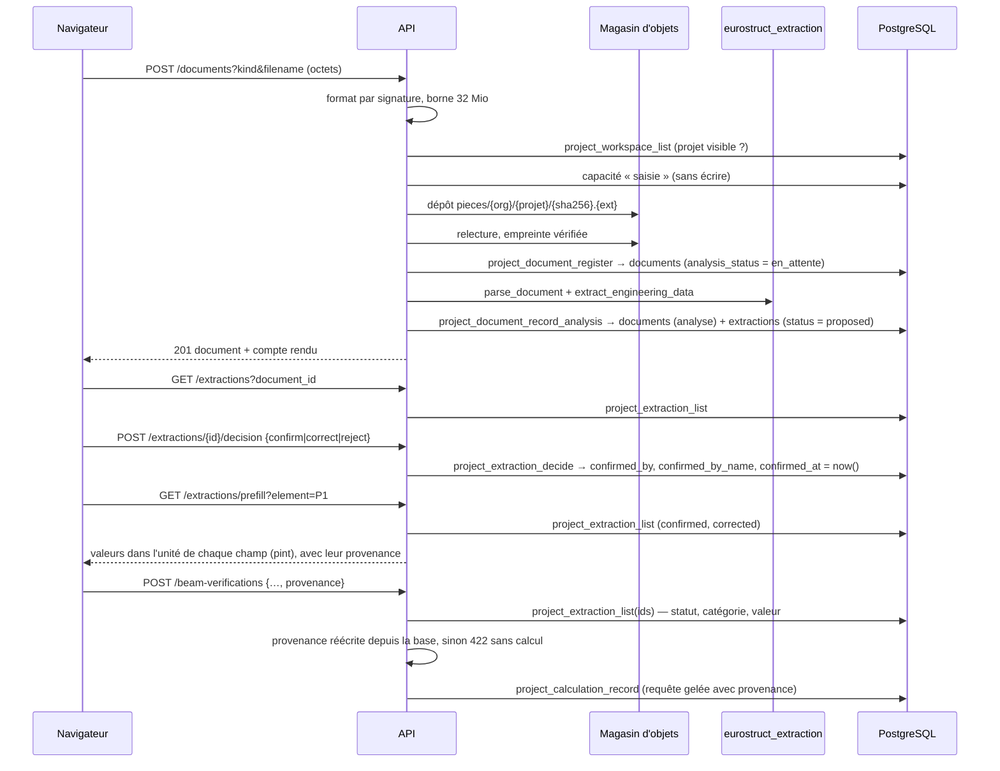

# Lecture des plans — dépôt, extraction, revue, report dans l'étude

> Statut : **proposition d'architecture et plan de réalisation**, écrits avant
> le code. Les sections 1 à 5 répondent, dans l'ordre, aux cinq livrables
> demandés : architecture, flux de données en base, points d'API, écrans,
> plan de réalisation. La section 6 dit ce que ce lot ne fait pas.

## 0. Point de départ mesuré

- L'ingénieur saisit toutes les grandeurs dans l'étude guidée en sept étapes
  (`web/components/verification/EtudeGuidee.tsx`). Aucun écran ne permet de
  déposer un fichier ; aucune route n'en reçoit.
- `documents` et `extractions` existent depuis `0001_init.sql`, avec RLS
  activée et forcée (`0002`), et **n'ont jamais reçu une ligne** par le chemin
  produit. Seule `db/test/01_guarantees.sql` §8 y écrit, pour prouver qu'une
  extraction `confirmed` sans signataire est refusée
  (`confirmed_extraction_is_signed`).
- Le moteur refuse une provenance `document_extraction` sans `confirmed_by`
  (`Ec2BeamFlexureRequest._extracted_values_must_be_confirmed`). Ce refus porte
  sur ce que **le client déclare** : rien ne relie aujourd'hui un
  `confirmed_by` à une décision enregistrée. L'étude complète
  (`Ec2BeamVerificationRequest`) ne porte aucune provenance.
- Les livrables ont déjà un magasin d'objets adressé par contenu
  (`stockage.py`), une primitive qui rend l'emplacement des octets, un
  téléchargement qui vérifie l'empreinte au fil de la lecture, et un
  rapprochement en lecture seule (`reconciliation.py`).

Ce lot réutilise ces quatre mécanismes. Il n'en crée pas de seconds.

## 1. Architecture

```
 navigateur                API (FastAPI)                         PostgreSQL 16
 ───────────               ─────────────                         ─────────────
 Documents du projet ──▶  routes/documents.py                    0028: documents,
 (dépôt, liste)            │                                     extractions,
                           ├─ documents.upload_document() ─────▶ project_document_register
 Revue des valeurs  ──▶    │    magasin (stockage.py)            project_document_record_analysis
 (comparer, corriger,      ├─ eurostruct_extraction              project_document_list
  confirmer, rejeter)      │    .parse_document()                project_document_bytes
                           │    .extract_engineering_data()      project_extraction_list
 Étude guidée       ──▶    ├─ documents.create_extraction_records()  project_extraction_decide
 (report + provenance)     ├─ documents.confirm_extraction() ──▶
                           ├─ documents.preremplissage()
                           └─ routes/projets.py
                                beam-verifications: contrôle de provenance ─▶ project_extraction_list
```

### 1.1 Un module d'extraction séparé : `eurostruct/extraction/`

Paquet Python `eurostruct_extraction`, **distinct du moteur et de l'API**.

- **Pourquoi pas dans le moteur.** Le moteur a une liste blanche de
  dépendances (`engine/scripts/audit_engine_dependencies.py`) : pint,
  pydantic, ezdxf, numpy. Lire un PDF exige pdfplumber, pypdfium2 et, pour
  l'OCR, Tesseract. Les y ajouter élargirait la surface du code qui produit
  les résultats de calcul. La lecture d'un plan ne calcule rien.
- **Pourquoi pas dans l'API.** Le module ne connaît ni la base, ni le réseau,
  ni l'identité. Il reçoit des octets et rend des propositions : il se teste
  sans PostgreSQL, et un futur service séparé (file d'attente, GPU) pourra
  l'appeler tel quel.
- **Déterministe.** Mêmes octets, même version, mêmes propositions. Aucun
  modèle de langage (interdiction 1) ; aucune valeur qui ne soit lue dans le
  document (interdiction 2).

Surface publique :

| Fonction | Rôle |
|---|---|
| `detecter_format(octets)` | PDF (`%PDF-`), DXF ASCII ou binaire, DWG (`AC10xx` + version) ; tout le reste est refusé. |
| `parse_document(octets, …) -> DocumentAnalyse` | Lit le document : mots et positions par page (couche texte native, sinon OCR borné), entités DXF ; dit ce qui n'a pas été lu. |
| `extract_engineering_data(analyse, extracteurs=…) -> list[Candidat]` | Applique la chaîne d'extracteurs et rend des **propositions**, chacune tracée. |
| `VERSION_EXTRACTEUR` | Écrite sur chaque document analysé et chaque proposition (`model_name`). |

Organisation interne :

```
extraction/src/eurostruct_extraction/
  formats.py          détection par signature, version DWG
  modele.py           Mot, PageLue, DocumentAnalyse, Candidat (dataclasses gelées)
  lecteurs/pdf.py     pdfplumber : mots + boîtes en points PDF
  lecteurs/ocr.py     pypdfium2 + Tesseract (fra+eng), pages sans couche texte, borné
  lecteurs/dxf.py     ezdxf : TEXT, MTEXT, DIMENSION, axes ($INSUNITS tracé)
  lecteurs/dwg.py     version lue, contenu NON lu ; ConvertisseurDWG (protocole)
  extracteurs/motifs.py      règles FR / NL / EN sur les lignes de texte
  extracteurs/dxf_entites.py cotes et axes depuis les entités DXF
  extracteurs/vision.py      protocole ModeleDeVision (aucun modèle livré)
  registre.py         Extracteur (protocole), chaîne par défaut
  categories.py       les catégories, leur forme de valeur, leur dimension
```

### 1.2 Ce qu'une proposition porte — toujours

Chaque `Candidat` devient **une** ligne d'`extractions`, et la base refuse une
ligne qui ne porte pas tout ceci (contrainte `extraction_is_traced`, §2) :

| Exigence | Colonne |
|---|---|
| document source | `document_id` (clé étrangère, existante) |
| page | `page` (≥ 1 ; un DXF n'a qu'un espace objet : page 1) |
| boîte ou position | `bbox` (x0, y0, x1, y1 en points PDF, origine en haut à gauche) **ou** `position` (jsonb : calque, poignée, point d'insertion DXF ; dimensions de page) |
| score de confiance | `confidence` dans [0 ; 1[ — **jamais 1** : indicatif, il n'ouvre aucune acceptation automatique |
| texte brut lu | `raw_text` (non vide) |
| méthode | `method` : `texte_natif`, `ocr`, `dxf`, `vision` |
| règle et version | `model_name` (= `VERSION_EXTRACTEUR`), `basis` (règle appliquée, origine de l'unité) |

**L'unité n'est jamais devinée en silence.** `basis.unit_basis` vaut
`explicite` (écrite à côté du nombre), `declaration` (mention du document du
type « cotes en cm », citée avec sa page), `convention` (notation de niveau
`+3,20`, diamètre `HA20`) ou `absente` — auquel cas l'unité proposée est
`null`, et la valeur ne peut pas être reportée sans correction.

Forme d'une valeur, proposée comme retenue : `{"value": nombre|texte, "unit":
texte|null}` — une grandeur par ligne. Deux grandeurs lues ensemble
(`P1 30x60` : largeur et hauteur) donnent deux lignes reliées par
`element_label = 'P1'`.

### 1.3 Catégories lues, et ce qu'elles deviennent

| Catégorie (`kind`) | Exemple lu | Champ de l'étude |
|---|---|---|
| `grid_line` | `Axe B`, axe DXF étiqueté | — |
| `grid_spacing` | cote DXF entre axes | — |
| `beam_span` | `portée 6,00 m` | `geometry.l_eff` **avec avertissement** (§5.3.2.2 : une portée entre axes n'est pas toujours la portée utile) |
| `beam_width`, `beam_depth` | `P1 30x60 (cm)` | `geometry.b`, `geometry.h` |
| `slab_thickness` | `dalle ép. 20 cm` | — |
| `floor_level` | `niveau +3,20` | — |
| `story_height` | `hauteur d'étage 3,00 m` | — |
| `column_width`, `column_depth`, `column_diameter` | `C1 30x30`, `poteau Ø40` | — |
| `concrete_class` | `C30/37` | `materials.concrete_grade` (si nuance du moteur) |
| `steel_grade` | `B500B`, `S355`, `BE500S` | `materials.steel_grade` (seulement `B500A/B/C`, liste du moteur) |
| `exposure_class` | `XC3` | `exposure_class` |
| `concrete_cover` | `enrobage 30 mm` | `cover` |
| `bar_count`, `bar_diameter` | `4 HA 20` | `bars.count`, `bars.diameter` |
| `link_diameter`, `link_spacing` | `cadres HA8 e=15 cm` | `links.diameter`, `links.spacing` |
| `load_value` | `Q = 2,5 kN/m²` | — **jamais** `M_Ed` : une charge n'est pas une sollicitation |
| `building_dimension` | `longueur totale 24,00 m` | — |
| `dimension` | cote DXF non classée | — |
| `material_specification` | ligne de spécification complète | — |
| `structural_note` | `NOTE : …` | — |

`geometry.d` n'est **jamais** reporté : c'est une grandeur dérivée, et le
produit ne dérive rien dans le navigateur.

### 1.4 Prêt pour la vision par ordinateur

`extracteurs/vision.py` déclare le protocole `ModeleDeVision` :

```python
class ModeleDeVision(Protocol):
    nom: str
    version: str
    def detecter(self, page: PageRendue) -> Sequence[ObjetDetecte]: ...

ObjetDetecte(classe: Literal["beam", "column", "slab", "wall", "dimension"],
             bbox, confiance, attributs: Mapping[str, ValeurLue])
```

Un adaptateur convertit chaque objet détecté en `Candidat` (`method = 'vision'`,
même traçabilité, même revue). **Aucun modèle n'est livré** : la chaîne par
défaut n'en contient pas, et un modèle ne pourra jamais faire plus que
proposer — la contrainte de décision humaine est en base, pas dans le modèle.
Le test du protocole utilise un détecteur de test déclaré comme tel, jamais
inscrit dans la chaîne de production.

### 1.5 DWG

Le DWG est un format propriétaire. Le lire nativement exige une licence ODA ou
RealDWG (interdiction 7, tranchée : DXF R2018 via ezdxf). Ce lot :

- **accepte** le dépôt d'un DWG, le conserve, l'empreinte, en lit la version
  (`AC1032` → AutoCAD 2018) ;
- le marque `analysis_status = 'non_lu'`, avec le motif et le remède
  (exporter en DXF depuis le logiciel de DAO) ;
- prévoit `ConvertisseurDWG` (protocole) : le jour où une conversion sous
  licence est configurée, le DWG converti suit le chemin DXF, et la ligne
  dit quelle conversion a servi.

### 1.6 Le service de l'API : `eurostruct_api/documents.py`

| Interface demandée | Implémentation |
|---|---|
| `uploadDocument()` | `upload_document()` : format, taille, capacité de saisie **avant** tout dépôt, dépôt → relecture → empreinte → `project_document_register` |
| `parseDocument()` | `eurostruct_extraction.parse_document()` |
| `extractEngineeringData()` | `eurostruct_extraction.extract_engineering_data()` |
| `createExtractionRecords()` | `create_extraction_records()` : **un** appel à `project_document_record_analysis`, qui écrit le compte rendu d'analyse et toutes les propositions dans la même transaction |
| `confirmExtraction()` | `confirm_extraction()` → `project_extraction_decide` |

Côté navigateur, `web/lib/documents.ts` expose `uploadDocument()`,
`listDocuments()`, `listExtractions()`, `confirmExtraction()`,
`prefill()`.

## 2. Flux de données en base



```
documents (1) ──< extractions (n)
  analysis_status : en_attente → analyse | partiel | non_lu | echec
                    (une nouvelle analyse n'est possible que tant qu'AUCUNE
                     proposition n'existe pour ce document)

extractions.status : proposed ──▶ confirmed   final_value = proposed_value
                              ├─▶ corrected   final_value ≠ proposed_value
                              └─▶ rejected    final_value nulle
                     (toute décision est DÉFINITIVE et signée :
                      confirmed_by, confirmed_by_name, confirmed_at)
```

### 2.1 Migration `0028_documents_extractions.sql`

Les migrations historiques ne sont pas modifiées ; tout passe par celle-ci.

**`documents`**, colonnes ajoutées : `storage_backend`, `format`
(`pdf|dxf|dwg`), `analysis_status`, `analysis_detail`, `analysis_report`
(jsonb : méthode par page, pages non lues et pourquoi, version DWG),
`text_layer`, `extractor_version`, `analysed_at`.

**`extractions`**, colonnes ajoutées : `raw_text`, `element_label`,
`position` (jsonb), `method`, `basis` (jsonb), `confirmed_by_name`,
`decision_note`.

**Contraintes** (`not valid`, comme `storage_path_derives_from_sha` en 0020 :
elles s'appliquent à toute écriture nouvelle) :

- `documents` : empreinte sha256 hexadécimale, chemin dérivé de l'empreinte,
  format et statut énumérés, taille > 0 et ≤ 32 Mio ;
- `extraction_is_traced` : texte brut non vide, page ≥ 1, `bbox` (4 nombres
  ordonnés) ou `position`, confiance dans [0 ; 1[, méthode, version ;
- `extraction_value_shape` : `{value, unit}` exactement, pour la proposition
  et la valeur retenue ;
- `extraction_decision_coherent` : `proposed` sans décision ; `confirmed`
  ⇒ retenue = proposée ; `corrected` ⇒ retenue ≠ proposée ; `rejected` ⇒
  aucune valeur retenue ; toute décision porte acteur, nom et date.

**Déclencheurs** (`project_extraction_garde`, `project_document_garde`,
chemin épinglé `public, pg_temp`) : une décision est définitive ; les colonnes
de provenance (document, page, boîte, position, texte brut, proposition,
catégorie, confiance, méthode, version) ne changent jamais ; l'identité d'un
document (empreinte, chemin, taille, format, nature, déposant) non plus ; son
compte rendu d'analyse ne change plus dès qu'une proposition existe.

**Droits** : le propriétaire des primitives reçoit `select, insert, update`
sur les deux tables — **pas** `delete` (conservation décennale) — et des
politiques nommément adressées (`project_actor_is_member` en lecture,
`project_actor_can_write` en écriture). La capacité `saisie` s'ajoute à
`project_exiger_capacite` : `owner`, `admin`, `engineer`,
`validating_engineer`, membres actifs — exactement ceux qui lancent un calcul.
Un `viewer` lit, ne dépose pas, ne décide pas.

**Six primitives** `SECURITY DEFINER`, accordées au seul backend authentifié :

| Primitive | Capacité | Effet |
|---|---|---|
| `project_document_register` | saisie | inscrit le document ; idempotente par (projet, empreinte) |
| `project_document_record_analysis` | saisie | compte rendu + toutes les propositions, en une transaction ; refuse s'il existe déjà des propositions |
| `project_document_list` | lecture | documents et décompte des propositions par statut |
| `project_document_bytes` | lecture | emplacement des octets (pour le téléchargement et une nouvelle analyse) |
| `project_extraction_list` | lecture | propositions d'un projet, d'un document ou d'une liste d'identifiants |
| `project_extraction_decide` | saisie | confirme, corrige ou rejette ; le **nom vient de l'adhésion** (`organization_members.display_name`), jamais du corps — sans nom enregistré, refus, comme pour l'attestation |

Le rôle de rapprochement reçoit `select` sur les colonnes de `documents` qui
désignent des octets (identifiant, organisation, projet, magasin, chemin,
empreinte, taille), et rien d'autre : le rapprochement couvre désormais les
pièces déposées, qui sinon apparaîtraient comme orphelines.

## 3. Points d'API

Toutes les routes exigent un jeton vérifié ; l'organisation vient du projet,
jamais du corps. Refus : 401 jeton ; 413 trop gros ; 415 format non pris en
charge ; 422 refus métier — projet hors de vos organisations, capacité
absente, décision déjà prise, avec le message écrit par la base ; 503 magasin
ou base indisponible.

| Méthode et chemin | Corps / paramètres | Réponse |
|---|---|---|
| `POST /v1/projects/{id}/documents?kind=…&filename=…` | octets bruts du fichier (≤ 32 Mio) ; `kind` ∈ `architect_drawing`, `formwork_drawing`, `cctp`, `other` | **201** `DocumentDepose` : document, compte rendu d'analyse, nombre de propositions — **200** `deja_present` si les mêmes octets sont déjà dans le projet (aucune seconde analyse) |
| `GET /v1/projects/{id}/documents` | — | `ListeDocuments` (statut d'analyse, décomptes par statut de décision) |
| `GET /v1/projects/{id}/documents/{doc}/download` | — | les octets, empreinte vérifiée au fil de la lecture |
| `POST /v1/projects/{id}/documents/{doc}/analysis` | — | nouvelle analyse, **seulement** si aucune proposition n'existe (échec, DWG non lu, aucun résultat) |
| `GET /v1/projects/{id}/extractions?document_id=&status=` | filtres facultatifs | `ListeExtractions` |
| `POST /v1/projects/{id}/extractions/{ext}/decision` | `{"decision": "confirm" \| "correct" \| "reject", "final_value": {value, unit}?, "note": "…"?}` | l'extraction décidée, avec nom et date du décideur |
| `GET /v1/projects/{id}/extractions/prefill?element=P1` | repère facultatif | `Preremplissage` : pour chaque champ de l'étude, la valeur confirmée **convertie par pint dans l'unité du champ**, sa provenance ; les conflits ; ce qui ne se reporte pas, et pourquoi |
| `POST /v1/projects/{id}/beam-verifications` | inchangé, plus `provenance` facultative : `{chemin: {kind: "document_extraction", extraction_id, …}}` | inchangé ; **422 `provenance_refusee`** sans calcul ni écriture si une provenance ne correspond pas à une extraction confirmée ou corrigée du projet, de la bonne catégorie, et de **même valeur** |

Le contrôle de provenance est le cœur de l'exigence 6 :

1. le schéma refuse une provenance `document_extraction` sans
   `extraction_id` ni `confirmed_by` (premier mur, déjà présent pour la
   flexion) ;
2. l'API relit chaque extraction **sous l'identité de l'appelant** : statut
   `confirmed`/`corrected`, catégorie compatible avec le champ, valeur
   envoyée = valeur retenue (égalité de grandeurs par pint : `6 m` = `6000
   mm`) — sinon refus ;
3. la provenance enregistrée est **réécrite depuis la base** (document, page,
   boîte, nom et date du confirmateur) : un client ne peut pas faire écrire
   une provenance qu'il a inventée ;
4. une valeur saisie à la main n'a pas de provenance, et la requête gelée
   d'une étude sans document est identique, octet pour octet, à celle d'avant
   ce lot (même identité d'exécution).

## 4. Écrans

**Étape préalable « Documents du projet »**, au-dessus de l'étude guidée
(`web/components/documents/DocumentsDuProjet.tsx`) — les sept étapes de
l'étude ne changent pas :

- choix de la nature (plan d'architecte, plan de coffrage, cahier des
  charges, autre) et du fichier (`.pdf`, `.dxf`, `.dwg`, glisser-déposer) ;
- liste des documents : nom, nature, format, pages, statut d'analyse en
  clair (« analysé », « partiellement lu : pages 6 à 40 au-delà de la borne
  d'OCR », « DWG conservé, non lu : exportez un DXF »), décomptes
  « 12 à revoir · 5 confirmées · 1 corrigée · 2 rejetées », téléchargement.

**Écran de revue** (`RevueExtractions.tsx`), par document :

- tableau : catégorie, repère, valeur proposée, valeur retenue, page,
  méthode et confiance, texte brut cité, origine de l'unité ;
- filtres par statut et par catégorie ;
- par ligne : **Confirmer** (la valeur proposée devient la valeur retenue),
  **Corriger** (saisie valeur + unité, motif), **Rejeter** (motif) ;
- avant de décider : « vous décidez en tant que *nom enregistré*, la date est
  posée par le serveur » ; après : nom et date affichés ;
- une ligne confirmée ou corrigée qui correspond à un champ de l'étude
  propose **Reporter dans l'étude** ; un bouton global reporte toutes les
  valeurs sans conflit pour le repère courant.

**Étude guidée** : un champ rempli par report porte un badge « extrait de
*plan.pdf*, p. 2 — confirmé par *nom* le *date* ». **Modifier le champ retire
le badge** : la valeur redevient une saisie, et la provenance n'est plus
envoyée. Rien n'est converti ni calculé dans le navigateur : les valeurs
arrivent déjà dans l'unité du champ.

## 5. Plan de réalisation

Commits séparés, dans cet ordre ; chaque étape a ses tests.

1. **Ce document.**
2. **Base** — `0028_documents_extractions.sql` ; garanties
   `db/test/06_documents_extractions.sql` (traçabilité, forme, décision
   définitive, provenance immuable, aucune suppression, isolation entre
   organisations, `viewer` refusé, nom exigé) ; fixture de `01_guarantees.sql`
   §8 rendue traçable, avec contrôle positif ; surface du backend (28 → 34)
   dans `authority_sql_hardening.sh` ; colonnes du rapprochement dans
   `reconciliation_role.sh`.
3. **Module d'extraction** — paquet, lecteurs, extracteurs, registre ; tests
   sur des PDF, DXF et DWG **générés par les tests** (aucun plan réel commité),
   dont un PDF sans couche texte lu par OCR ; surface « extraction » dans
   `run_tests.sh` et en intégration continue.
4. **API et contrats** — `ProvenanceDTO.extraction_id`, provenance de l'étude
   complète, schémas `documents` exportés en TypeScript ; méthodes de
   `PostgresAtelier` ; service et routes ; contrôle de provenance ;
   rapprochement étendu ; tests sans base et harnais
   `db/test/documents_extractions.sh` (dépôt réel, analyse, revue, report,
   calcul accepté, calcul refusé sur valeur non confirmée ou modifiée).
5. **Interface** — étape Documents, revue, report et badges ; parcours
   navigateur réel (dépôt d'un PDF généré, revue, confirmation, report,
   calcul).
6. **Image et documentation** — `api/Dockerfile` (paquet d'extraction,
   `tesseract-ocr` fra/eng), `ESSAYER.md`, `README.md` ; campagne canonique
   sur SHA gelé, recette de mise à niveau (26 → 28), push.

## 6. Ce que ce lot ne fait pas, et le dit

- **Il ne lit pas le DWG** (§1.5) ; il le conserve et dit comment obtenir une
  lecture.
- **L'OCR est borné** (nombre de pages, pixels par page) et faible sur des
  plans : un texte lu par OCR a une confiance plafonnée, et le compte rendu
  nomme les pages non lues.
- **Le rappel est partiel.** Les règles reconnaissent des écritures
  courantes en français, néerlandais et anglais ; un plan peut contenir une
  grandeur qu'aucune règle ne voit. L'ingénieur reste la source : la saisie
  manuelle est inchangée.
- **Une proposition n'est qu'une proposition.** Rien n'est confirmé
  automatiquement, aucun seuil de confiance n'y conduit.
- **Une charge lue n'est jamais une sollicitation.** `load_value` est
  affichée et confirmable, jamais reportée dans `M_Ed`, `V_Ed`, `M_char`,
  `M_qp`.
- **Aucun modèle de vision n'est livré** ; l'interface l'attend (§1.4).
- **Une décision est définitive.** Une valeur confirmée à tort se remplace
  dans l'étude par une saisie, et la décision reste dans l'historique.
- **L'analyse est synchrone** et bornée ; un service asynchrone pourra
  appeler le même module sans changer le contrat de la base.

### Interdictions concernées

| Interdiction | Où elle est tenue |
|---|---|
| 1 — aucun résultat par un LLM | aucun modèle de langage ; règles déterministes ; le module ne calcule rien |
| 2 — aucune valeur non tracée | `extraction_is_traced` ; unité « absente » plutôt que devinée ; `basis` dit d'où vient l'unité |
| 5 — aucune cote extraite sans confirmation | statut `proposed` à l'écriture ; décision humaine signée en base ; contrôle de provenance avant le moteur |
| 7 — pas de « DWG natif » | DWG conservé, non lu ; conversion déclarée comme protocole |
| 8 — mention obligatoire | inchangée : les notes la portent, qu'une valeur vienne d'un plan ou d'une saisie |
| 9 — aucun arrondi complaisant | égalité de grandeurs exacte (pint) entre valeur envoyée et valeur retenue |
